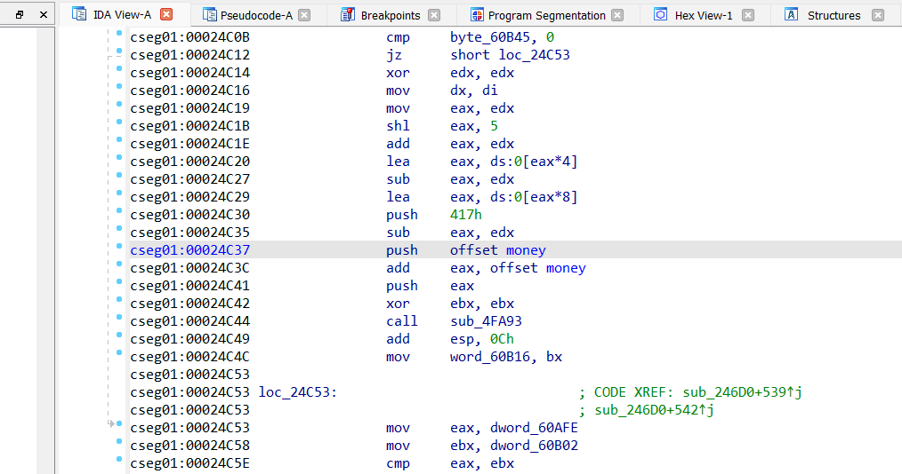
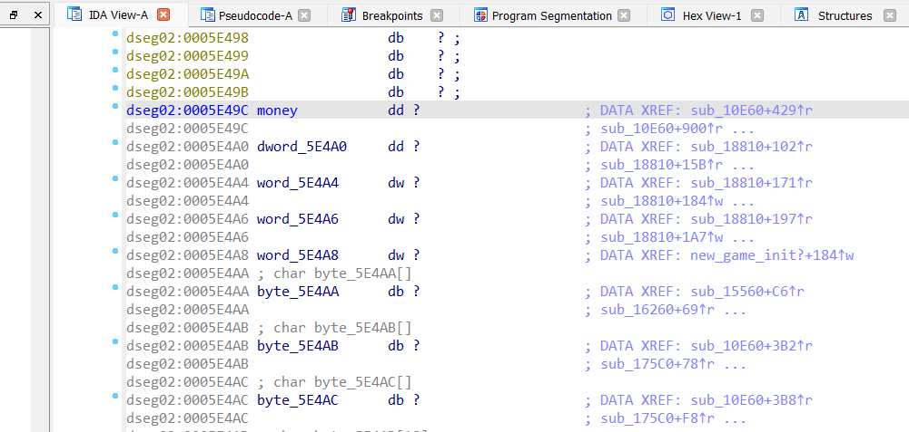
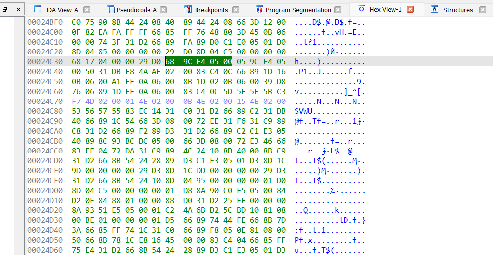
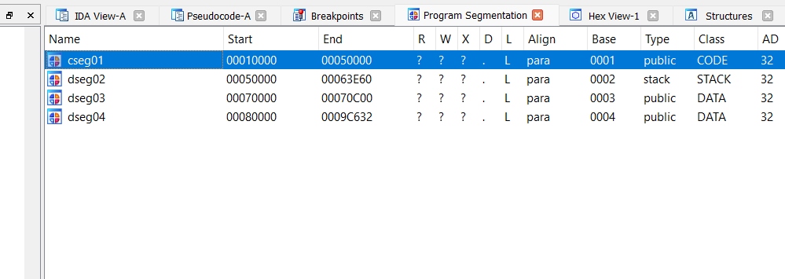
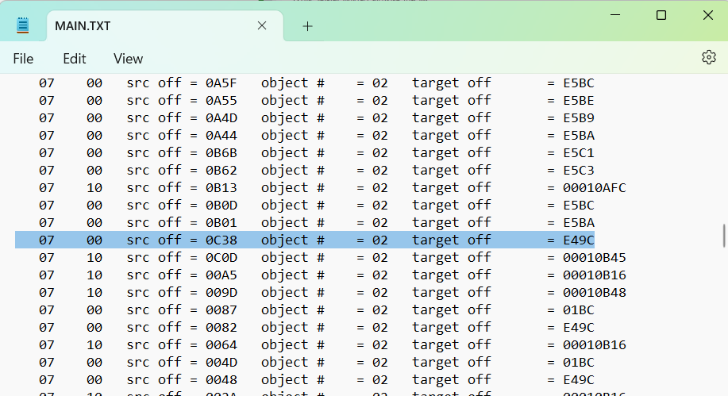
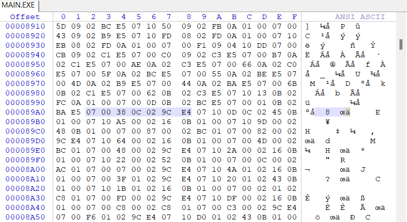

[](LICENSE)
[](LICENSE)

# LEtool
This is a small program designed to help manipulate DOS Linear Executable (DOS4GW) programs. While it is still a work in progress, most of the challenging work has already been completed. Essentially, it involves adding a page at the end of the code section and allocating space for its fixups. You can specify fixups to be written automatically by using the 'fixup.txt' file.

Another tool that can aid in understanding Watcom's LE format is 'wdump.exe' from Open Watcom v2. It is a LE dumping tool.

# Usage
```c
  letool.exe -a <lefilename>
```
# Fixups
As I developed the tool, I discovered only two types of fixups, based on target flags, inside my target LE file: internal references (00h) and 32-bit Target Offset Flags (10h).

Here's an example of a fixup in IDA, named 'money.' I located them using 'Edit -> Plugins -> Jump to next fixup.



Now, using this example at offset 24C37, we can see that 'money' is actually located at address 5E49C, as shown below:



If we examine the hex view of 24C37, we find the following:



From this, we can conclude that the source offset is 24C38.



Here, we can see that the code section starts at 10000h. From the LE info, we know that each page is 1000h in size. Therefore, for a source offset of 24C38, we can deduce it as C38.

The target offset, where the 'money' variable is placed, is in dseg02, or, as they call it, 'object 2.' The 'money' address is 5E49C, which is located in dseg02, starting from 50000h. So, it has a delta offset of E49Ch. When translated into fixup data, it becomes 0700380C029CE4.

We searched for this fixup in the fixup info dump (using wdump) and found it on this line:



We then searched for this pattern in the exe file using WinHex and found this:



Now, we understand how fixups are created. I hope you can understand it too, from this example. Good luck.


